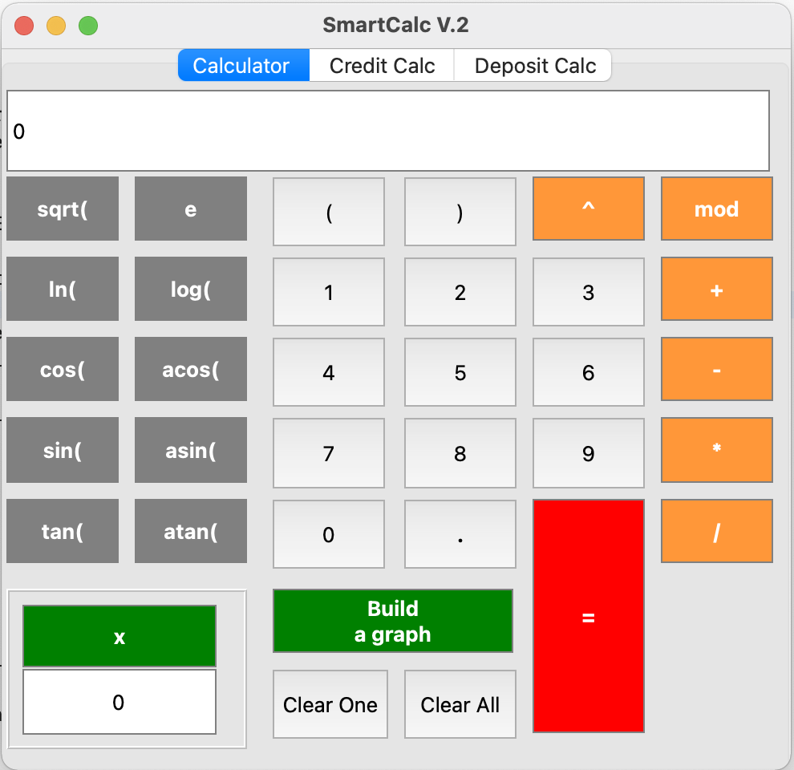

# CPP3_Calculator
Реализация на языке программирования С++ в парадигме объектно-ориентированного программирования расширенной версии обычного калькулятора. Помимо базовых арифметических операций, как плюс-минус и умножить-поделить, можно вычислять арифметические выражения с учетом приоритетов, а так же некоторыми математическими функциями (синус, косинус, логарифм и т.д.). Помимо вычисления выражений калькулятор также поддерживает использование переменной x и построение графика соответствующей функции. В качестве дополнительных улучшений реализован кредитный калькулятор.

Кредитный калькулятор с возможностью выбора типа платежей (аннуитетный и дифференцированный)

